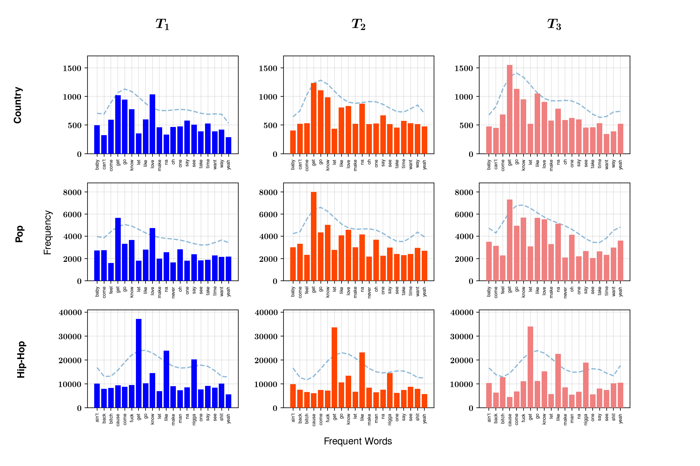
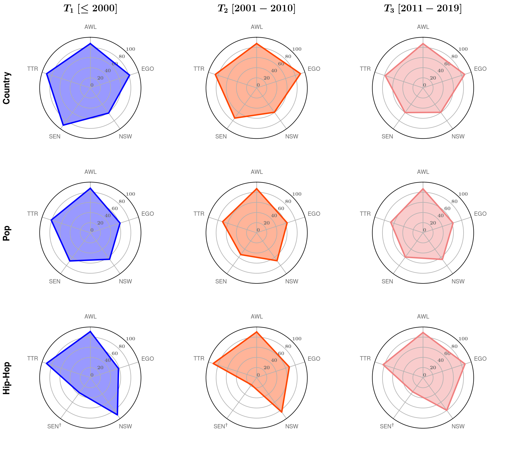
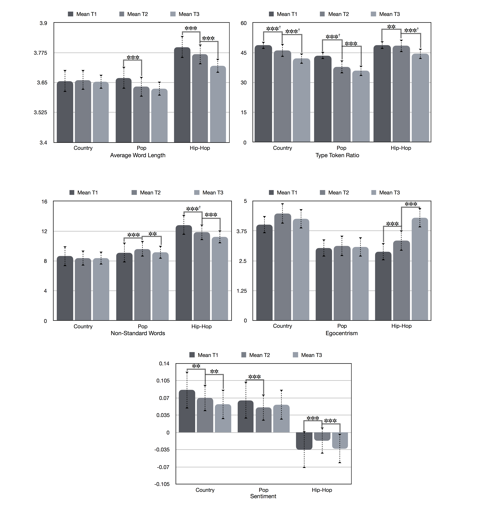
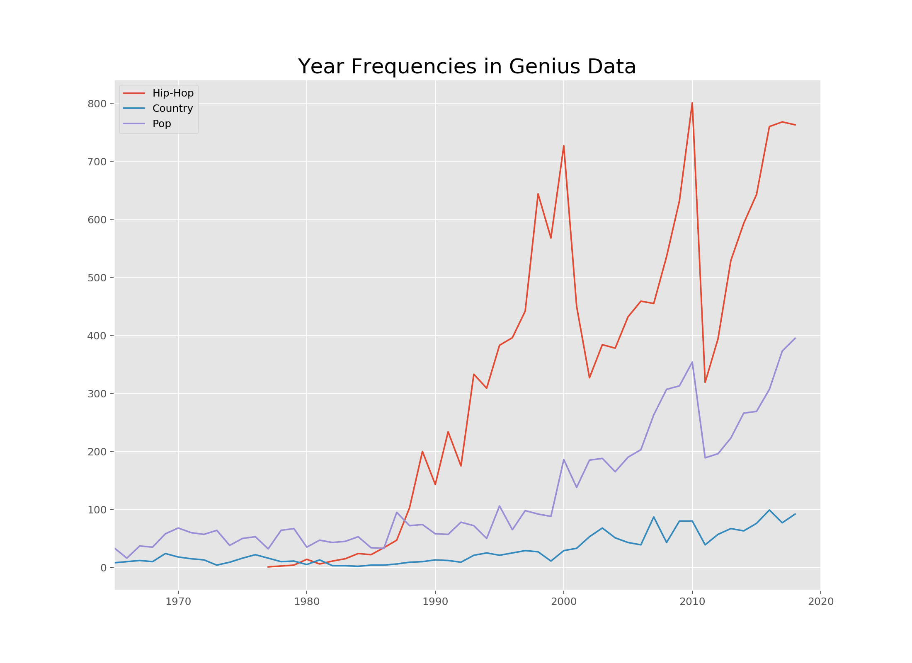
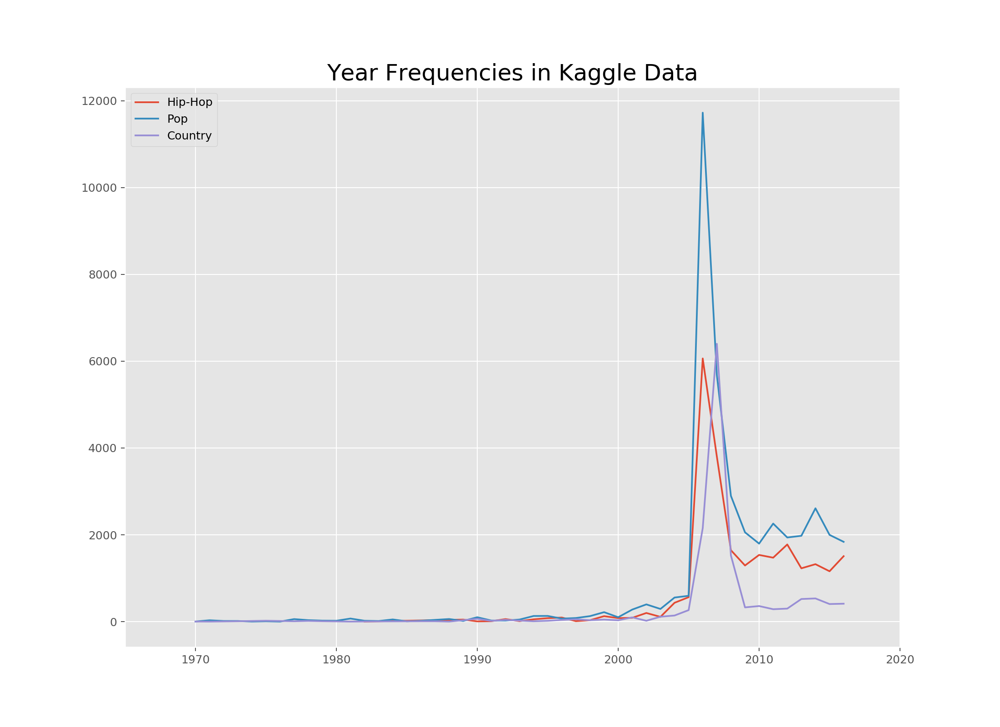
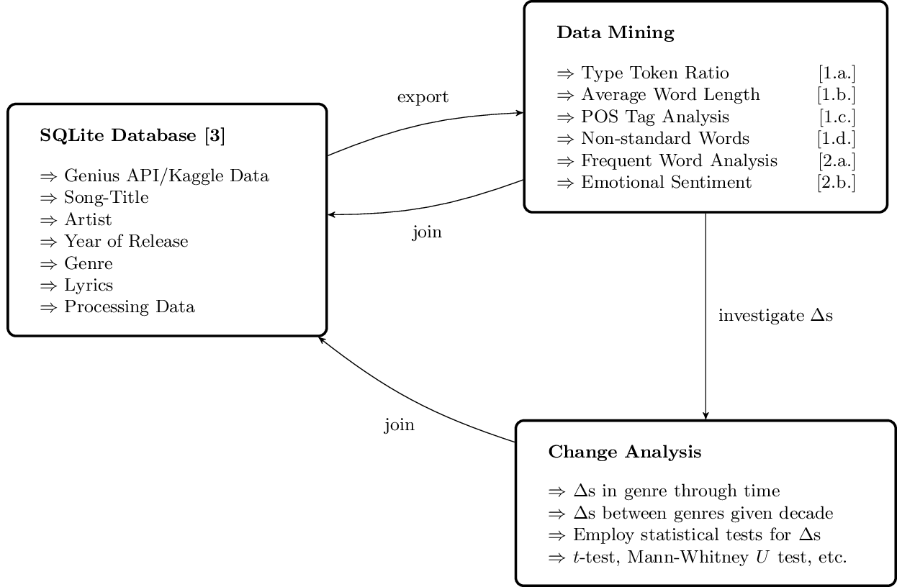

# ANLP :fire: Haxxors 2018

# Table of Contents
* [Overview](#Overview)
* [Usage](#Usage)
* [Organisation Guidelines](#Organisation-Guidelines)
* [Authors](#Authors)

This is a private repository for our ANLP group project. We like cheesy songs.

# Overview
For this project, we analyzed lyrics we collected from genius.com. We performed various cleaning, annotation and analytical methods on the collected data. To get a taste of our work before handing in our final papers, here some visualized results.


## most frequent words per genre:
We grouped our data in three by year. T1 = <1990, T2 = 2001-2010, T3 = 2011-2019.



## Annotations

As already mentioned, we performed a range of analysis on our data. Below shows a normalized spider plot for each of these metrics. The spider plot belows gives an overview of these for each unit. One inference we can draw from that is for example, that Hip-Hop is significantly more negative as other genres.

Legend:

| abbrev | metric |
|---|---|
|SEN|Sentiment value |
|TTR| Type- Token-Ratio |
|EGO| measure for egocentrism |
|NSW| non-standard words |
|AWL| average word length |



## Mean change between intervals



## Collection Bias

We also were successful in mitigating the temporal bias the original kaggle data had.



# Usage 
## Initialization

After cloning this repository, you would need to initialize it to prepare for testing:

```shell
$ ./init.sh
```

This process essentially downloads lyrics databases from git lfs and moves a pre-commit hook into your local `.git/hooks` folder.

## Overview of directories

```shell
$ tree -d -L 1
.
├── data # storage of large data
├── docs # documentation on project
├── hooks # github hooks for automation
├── src # source code, classes/functions
└── tmp # temporary or old scripts

5 directories
```

# Organisation Guidelines

## Workflow



## Task Delegation

| Person | Task |
| ------------- | ------------- |
| Jules (🐍) | [1.a], [1.b], [1.c], [1.d]|
| Atreya (🐌) | [2.a], [2.b]|
| Luis (🐿) | [3]|

## Guidelines for Pull Requests

Once we start to write our own code, it would be good to commit changes onto local branches and submit pull requests to merge with the master branch. This way, we can avoid conflicts in our commits.

To aid this process, we can refer to the some guidelines in [CONTRIBUTING.md](CONTRIBUTING.md).

## Milestones

| Date Due | Key Event |
| ------------- | ------------- |
| Dec. 14, 2018 | Group contract due |
| Jan. 11, 2019 | Planning paper due |
| Feb. 1, 2019 | Project presentation |
| **Mar. 1, 2019** | **Final project due** |
| Mar. 8, 2019 | Project report due |

### Further Contents

1. [Group Contract](docs/group_contract.md)

2. [Meeting Protocols](docs/protocols.md)

3. [Data Summarization](https://github.com/glaserL/anlp_ws18/tree/master/docs/summary)

4. [Shared Todo List](docs/todos.md)

5. [Shared Bibliography](docs/bibtex.bib)

### Authors

Atreya Shankar (🐌), Jules Hanel (🐍), Luis Glaser (🐿)

Cognitive Systems 2018, Advanced Natural Language Processing (ANLP)
